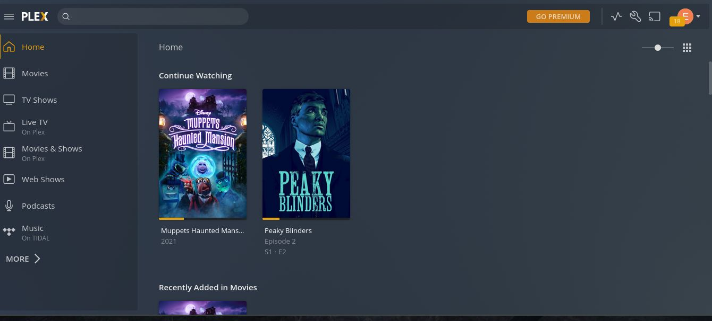
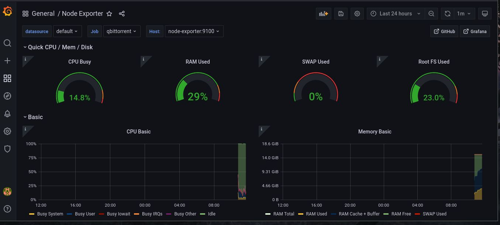
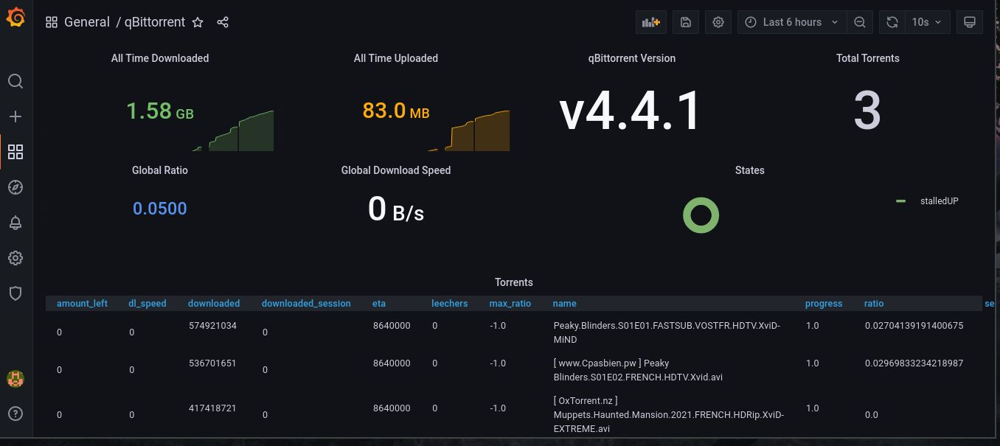

# Mediastack

Hugo Marques & Emma Durand.
___

# Projet

Création d'une mediastack.



**Outils :**

* radarr : navigateur de recherche qui permet le téléchargement automatique de fichiers (films).
* sonarr : navigateur de recherche qui permet le téléchargement automatique de fichiers (séries).
* plex : lecteur de multimédia pour visionner les séries et films.
* jackett : aggrégateur de torrents et interface pour radarr / sonarr.
* qbittorent : client torrent.
* flaresolverr : Bypass de cloudflare pour les sites de torrents qui l'utilise (YGGTorrent).
* heimdall : tableau de bord pour un accés rapide aux services.

___

**Installation**

* Pour prometheus, créer un dossier ```data/prometheus``` puis copier le fichier présent dans *example_files/prometheus.yml*. c'est la configuration de prometheus avec qbittorrent exporter. 

* Pour heimdall, créer un dossier ```data/heimdall/www``` puis copier le fichier préseent dans *example_files/app.sqlite*. c'est la base de données pré-remplie de heimdall.

```
docker-compose up -d
```
___

**Utilisation**

Sur jackett, il faut configurer les sites de torrent que l'on va utiliser et ajouter *http://localhost:8191* dans "*FlareSolverr API URL*".

Sur radarr et sonarr, il faut configurer nos indexeurs de torrent (jackett) *Torznab* puis spécifier le client qui va télécharger nos films / séries (qbittorrent). Ensuite sur l'interface, via une recherche, on lance le téléchargement automatique du fichier (il apparaît sur qbittorrent).

Une fois le téléchargement terminé, il suffit de se rendre sur plex pour visionner le film ou la série.

___

**Monitoring :**

*Outils :*

* Grafana : outils de supervision pour la visualisation de données.
* Prometheus : base de données.
* qbittorrent-exporter : permet d'exporter les métriques de qbitorrent et de les envoyer dans prometheus.
* node-exporter : permet d'exporter les métriques systèmes, réseaux, disques ...





___


**Backup**

* Backup sur Google Drive avec RClone :

1. Guide de RClone pour créer un client_id : https://rclone.org/drive/#making-your-own-client-id

2. Récuperer l'ID d'un fichier sur Google Drive : https://rclone.org/drive/#root-folder-id

Marche à suivre pour la configuration de Google Drive avec RClone : 

```
curl https://rclone.org/install.sh | sudo bash
rclone config
n
GDrive
drive
CLIENT_ID
CLIENT_SECRET
drive
FOLDER_ID
**TOUCHE ENTRÉE**
n
y
y
```

On ajoute la crontab qui va sauvegarder les films sur le drive : 

```
0 4 * * * rclone copy /movies/ GDrive: --drive-stop-on-upload-limit --ignore-existing
```

___

**Problèmes rencontrés :**

- permission sur les volumes pour Grafana.
- nom d'hôte des conteuneurs (au lieu du sigle "localhost").
- selinux sur fedora qui empêche l'attribution des permissions par docker (obligé de le désactiver).

___

# URL

* radarr : http://localhost:7878
* plex : http://localhost:32400/manage
* jackett : http://localhost:9117
* qbittorrent : http://localhost:8080
* sonarr : http://localhost:8989
* qbittorrent-exporter : http://localhost:17871/metrics
* node-exporter : http://localhost:9100/metrics
* prometheus : http://localhost:9090
* grafana : http://localhost:3000
* flaresolverr : http://localhost:8191
* heimdall : http://localhost
